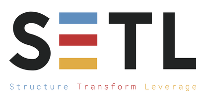

----------

[](https://travis-ci.com/JCDecaux/setl)
[](https://codecov.io/gh/JCDecaux/setl)
[](https://mvnrepository.com/artifact/com.jcdecaux.setl/setl)
[](https://javadoc.io/doc/com.jcdecaux.setl/setl_2.11)
[](https://gitter.im/setl-by-jcdecaux/community?utm_source=badge&utm_medium=badge&utm_campaign=pr-badge)

If you’re a **data scientist** or **data engineer**, this might sound familiar while working on an **ETL** project: 

- Switching between multiple projects is a hassle 
- Debugging others’ code is a nightmare
- Spending a lot of time solving non-business-related issues 

**SETL** (Spark ETL, pronounced "settle") is a Scala framework that helps you structure your Spark ETL projects, modularize your data transformation logic and speed up your development.

## Use SETL

### In a new project
You can start working by cloning [this template project](https://github.com/qxzzxq/setl-template).

### In an existing project
```xml
<dependency>
  <groupId>com.jcdecaux.setl</groupId>
  <artifactId>setl_2.11</artifactId>
  <version>0.4.0</version>
</dependency>
```

To use the SNAPSHOT version, add Sonatype snapshot repository to your `pom.xml`
```xml
<repositories>
  <repository>
    <id>ossrh-snapshots</id>
    <url>https://oss.sonatype.org/content/repositories/snapshots/</url>
  </repository>
</repositories>

<dependencies>
  <dependency>
    <groupId>com.jcdecaux.setl</groupId>
    <artifactId>setl_2.11</artifactId>
    <version>0.4.1-SNAPSHOT</version>
  </dependency>
</dependencies>
```

## Quick Start
### Basic concept
With SETL, an ETL application could be represented by a `Pipeline`. A `Pipeline` contains multiple `Stages`. In each stage, we could find one or several `Factories`.

The class `Factory[T]` is an abstraction of a data transformation that will produce an object of type `T`. It has 4 methods (*read*, *process*, *write* and *get*) that should be implemented by the developer.

The class `SparkRepository[T]` is a data access layer abstraction. It could be used to read/write a `Dataset[T]` from/to a datastore. It should be defined in a configuration file. You can have as many SparkRepositories as you want.

The entry point of a SETL project is the object `com.jcdecaux.setl.Setl`, which will handle the pipeline and spark repository instantiation.

### Show me some code
You can find the following tutorial code in [the starter template of SETL](https://github.com/qxzzxq/setl-template). Go and clone it :)

Here we show a simple example of creating and saving a **Dataset[TestObject]**. The case class **TestObject** is defined as follows:

```scala
case class TestObject(partition1: Int, partition2: String, clustering1: String, value: Long)
```

#### Context initialization
Suppose that we want to save our output into `src/main/resources/test_csv`. We can create a configuration file **local.conf** in `src/main/resources` with the following content that defines the target datastore to save our dataset:

```txt
testObjectRepository {
  storage = "CSV"
  path = "src/main/resources/test_csv"
  inferSchema = "true"
  delimiter = ";"
  header = "true"
  saveMode = "Append"
}
```

In our `App.scala` file, we build `Setl` and register this data store:
```scala  
val setl: Setl = Setl.builder()
  .withDefaultConfigLoader()
  .getOrCreate()

// Register a SparkRepository to context
setl.setSparkRepository[TestObject]("testObjectRepository")

```

#### Implementation of Factory
We will create our `Dataset[TestObject]` inside a `Factory[Dataset[TestObject]]`. A `Factory[A]` will always produce an object of type `A`, and it contains 4 abstract methods that you need to implement:
- read
- process
- write
- get

```scala
class MyFactory() extends Factory[Dataset[TestObject]] with HasSparkSession {
  
  import spark.implicits._
    
  // A repository is needed for writing data. It will be delivered by the pipeline
  @Delivery 
  private[this] val repo = SparkRepository[TestObject]

  private[this] var output = spark.emptyDataset[TestObject]

  override def read(): MyFactory.this.type = {
    // in our demo we don't need to read any data
    this
  }

  override def process(): MyFactory.this.type = {
    output = Seq(
      TestObject(1, "a", "A", 1L),
      TestObject(2, "b", "B", 2L)
    ).toDS()
    this
  }

  override def write(): MyFactory.this.type = {
    repo.save(output)  // use the repository to save the output
    this
  }

  override def get(): Dataset[TestObject] = output

}
```

#### Define the pipeline
To execute the factory, we should add it into a pipeline.

When we call `setl.newPipeline()`, **Setl** will instantiate a new **Pipeline** and configure all the registered repositories as inputs of the pipeline. Then we can call `addStage` to add our factory into the pipeline.

```scala
val pipeline = setl
  .newPipeline()
  .addStage[MyFactory]()
```

#### Run our pipeline
```scala
pipeline.describe().run()
```
The dataset will be saved into `src/main/resources/test_csv`

#### What's more?
As our `MyFactory` produces a `Dataset[TestObject]`, it can be used by other factories of the same pipeline.

```scala
class AnotherFactory extends Factory[String] with HasSparkSession {

  import spark.implicits._

  @Delivery
  private[this] val outputOfMyFactory = spark.emptyDataset[TestObject]

  override def read(): AnotherFactory.this.type = this

  override def process(): AnotherFactory.this.type = this

  override def write(): AnotherFactory.this.type = {
    outputOfMyFactory.show()
    this
  }

  override def get(): String = "output"
}
```

Add this factory into the pipeline:

```scala
pipeline.addStage[AnotherFactory]()
```

### Generate pipeline diagram (with v0.4.1+)
You can generate a [Mermaid diagram](https://mermaid-js.github.io/mermaid/#/) by doing:
```scala
pipeline.showDiagram()
```

You will have some log like this:
```
--------- MERMAID DIAGRAM ---------
classDiagram
class MyFactory {
  <<Factory[Dataset[TestObject]]>>
  +SparkRepository[TestObject]
}

class DatasetTestObject {
  <<Dataset[TestObject]>>
  >partition1: Int
  >partition2: String
  >clustering1: String
  >value: Long
}

DatasetTestObject <|.. MyFactory : Output
class AnotherFactory {
  <<Factory[String]>>
  +Dataset[TestObject]
}

class StringFinal {
  <<String>>
  
}

StringFinal <|.. AnotherFactory : Output
class SparkRepositoryTestObjectExternal {
  <<SparkRepository[TestObject]>>
  
}

AnotherFactory <|-- DatasetTestObject : Input
MyFactory <|-- SparkRepositoryTestObjectExternal : Input

------- END OF MERMAID CODE -------

You can copy the previous code to a markdown viewer that supports Mermaid.

Or you can try the live editor: https://mermaid-js.github.io/mermaid-live-editor/#/edit/eyJjb2RlIjoiY2xhc3NEaWFncmFtXG5jbGFzcyBNeUZhY3Rvcnkge1xuICA8PEZhY3RvcnlbRGF0YXNldFtUZXN0T2JqZWN0XV0-PlxuICArU3BhcmtSZXBvc2l0b3J5W1Rlc3RPYmplY3RdXG59XG5cbmNsYXNzIERhdGFzZXRUZXN0T2JqZWN0IHtcbiAgPDxEYXRhc2V0W1Rlc3RPYmplY3RdPj5cbiAgPnBhcnRpdGlvbjE6IEludFxuICA-cGFydGl0aW9uMjogU3RyaW5nXG4gID5jbHVzdGVyaW5nMTogU3RyaW5nXG4gID52YWx1ZTogTG9uZ1xufVxuXG5EYXRhc2V0VGVzdE9iamVjdCA8fC4uIE15RmFjdG9yeSA6IE91dHB1dFxuY2xhc3MgQW5vdGhlckZhY3Rvcnkge1xuICA8PEZhY3RvcnlbU3RyaW5nXT4-XG4gICtEYXRhc2V0W1Rlc3RPYmplY3RdXG59XG5cbmNsYXNzIFN0cmluZ0ZpbmFsIHtcbiAgPDxTdHJpbmc-PlxuICBcbn1cblxuU3RyaW5nRmluYWwgPHwuLiBBbm90aGVyRmFjdG9yeSA6IE91dHB1dFxuY2xhc3MgU3BhcmtSZXBvc2l0b3J5VGVzdE9iamVjdEV4dGVybmFsIHtcbiAgPDxTcGFya1JlcG9zaXRvcnlbVGVzdE9iamVjdF0-PlxuICBcbn1cblxuQW5vdGhlckZhY3RvcnkgPHwtLSBEYXRhc2V0VGVzdE9iamVjdCA6IElucHV0XG5NeUZhY3RvcnkgPHwtLSBTcGFya1JlcG9zaXRvcnlUZXN0T2JqZWN0RXh0ZXJuYWwgOiBJbnB1dFxuIiwibWVybWFpZCI6eyJ0aGVtZSI6ImRlZmF1bHQifX0=

```

You can either copy the code into a Markdown viewer or just copy the link into your browser ([link](https://mermaid-js.github.io/mermaid-live-editor/#/edit/eyJjb2RlIjoiY2xhc3NEaWFncmFtXG5jbGFzcyBNeUZhY3Rvcnkge1xuICA8PEZhY3RvcnlbRGF0YXNldFtUZXN0T2JqZWN0XV0-PlxuICArU3BhcmtSZXBvc2l0b3J5W1Rlc3RPYmplY3RdXG59XG5cbmNsYXNzIERhdGFzZXRUZXN0T2JqZWN0IHtcbiAgPDxEYXRhc2V0W1Rlc3RPYmplY3RdPj5cbiAgPnBhcnRpdGlvbjE6IEludFxuICA-cGFydGl0aW9uMjogU3RyaW5nXG4gID5jbHVzdGVyaW5nMTogU3RyaW5nXG4gID52YWx1ZTogTG9uZ1xufVxuXG5EYXRhc2V0VGVzdE9iamVjdCA8fC4uIE15RmFjdG9yeSA6IE91dHB1dFxuY2xhc3MgQW5vdGhlckZhY3Rvcnkge1xuICA8PEZhY3RvcnlbU3RyaW5nXT4-XG4gICtEYXRhc2V0W1Rlc3RPYmplY3RdXG59XG5cbmNsYXNzIFN0cmluZ0ZpbmFsIHtcbiAgPDxTdHJpbmc-PlxuICBcbn1cblxuU3RyaW5nRmluYWwgPHwuLiBBbm90aGVyRmFjdG9yeSA6IE91dHB1dFxuY2xhc3MgU3BhcmtSZXBvc2l0b3J5VGVzdE9iamVjdEV4dGVybmFsIHtcbiAgPDxTcGFya1JlcG9zaXRvcnlbVGVzdE9iamVjdF0-PlxuICBcbn1cblxuQW5vdGhlckZhY3RvcnkgPHwtLSBEYXRhc2V0VGVzdE9iamVjdCA6IElucHV0XG5NeUZhY3RvcnkgPHwtLSBTcGFya1JlcG9zaXRvcnlUZXN0T2JqZWN0RXh0ZXJuYWwgOiBJbnB1dFxuIiwibWVybWFpZCI6eyJ0aGVtZSI6ImRlZmF1bHQifX0=)) 🍻

## Dependencies

**SETL** currently supports the following data source:
  - All file formats supported by Apache Spark (csv, json, parquet etc)
  - Excel
  - JDBC (you have to provide the jdbc driver)
  - Cassandra
  - DynamoDB

To read/write data from/to AWS S3 (or other storage services), you should include the 
corresponding hadoop library in your project.

For example
```
<dependency>
    <groupId>org.apache.hadoop</groupId>
    <artifactId>hadoop-aws</artifactId>
    <version>2.9.2</version>
</dependency>
```

You should also provide Scala and Spark in your pom file. SETL is tested against the following version of Spark: 

| Spark Version | Scala Version  | Note                         |
| ------------- | -------------  | -----------------------------|
|     2.4       |        2.11    | :heavy_check_mark: Ok        |
|     2.4       |        2.12    | :heavy_check_mark: Ok        |
|     2.3       |        2.11    | :warning: see *known issues* |

## Known issues
- `DynamoDBConnector` doesn't work with Spark version 2.3
- `Compress` annotation can only be used on Struct field or Array of Struct field with Spark 2.3

## Documentation
[Check our wiki](https://github.com/JCDecaux/setl/wiki)

## Contributing to SETL
[Check our contributing guide](https://github.com/JCDecaux/setl/blob/master/CONTRIBUTING.md)

