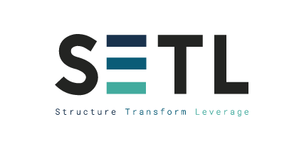

-----------
If you’re a **data scientist** or **data engineer**, this might sound familiar while working on **ETL** projects: 

- Switching between multiple projects is a hassle 
- Debugging others’ code is a nightmare
- Spending a lot of time solving non-business-related issues 

**SETL** (Spark ETL, pronounced "settle") is a Scala framework that helps you structure your Spark ETL projects, modularize your data transformation logic and speed up your development.

## Table of contents

- [Quick start](Quick-Start)
- [Setl](Setl)
- Data Access Layer
  - [Connector](data_access_layer/Connector)
    - [FileConnector](data_access_layer/Connector#fileconnector)
    - [DBConnector](data_access_layer/Connector#dbconnector)
    - [StructuredStreamingConnector](data_access_layer/Structured-Streaming-Connector)
    - [Use your own connector](data_access_layer/CustomConnector)
  - [Repository](data_access_layer/Repository)
  - [SparkRepositoryAdapter](data_access_layer/SparkRepositoryAdapter)
  - [ConnectorBuilder](data_access_layer/ConnectorBuilder)
  - [SparkRepositoryBuilder](data_access_layer/SparkRepositoryBuilder)
  - [Configuration Example](data_access_layer/configuration_example)
- Data Transformation API
  - [Transformer](Transformer)
  - [Factory](Factory)
- Workflow Management
  - [Stage](Stage)
  - [Pipeline](Pipeline)
  - [Pipeline execution optimization (preliminary feature)](PipelineOptimizer)
- Utilities
  - [Annotations](Annotations)
  - [SparkSession builder](SparkSessionBuilder)
  - [ConfigLoader](ConfigLoader)
  - [DateUtils](DateUtils)
  - [Condition](Condition)
- Developper
  - [StructAnalyser](StructAnalyser)
  - [SchemaConverter](SchemaConverter)
  - [PipelineInspector](PipelineInspector)
  - [PipelineOptimizer](PipelineOptimizer)
  - [DeliverableDispatcher](DeliverableDispatcher)
  - [Read cache strategy](SparkRepository-caching)
  - [Logging](Logging)

